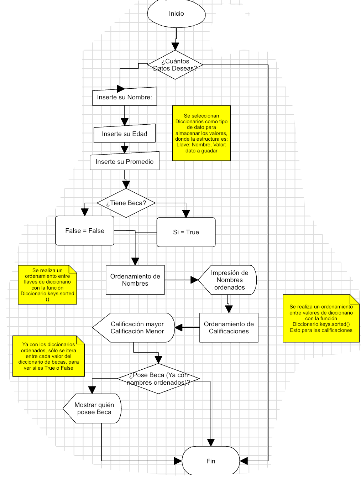

# Proyecto 1

## Planteamiento del Problema

Como primer proyecto para la materia de Cómputo Móvil, se dejó la siguiente Actividad:

Desarrollar un programa en el lenguaje de Programación Swift:

Capturar desde línea de comandos los datatos de alumnos, estos alumnos deben de tener las siguientes características:

1. Nombre: Este tipo de dato debe ser un *String*
2. Edad: Este tipo de dato debe ser un *Int*
3. Promedio: Este tipo de dato debe ser un *Double*
4. Si cuenta con Beca: Este tipo de dato debe ser un *Boolean*

**Nota:** Se deben capturar por lo menos 10 alumnos.

Una vez teniendo los datos de los 10 alumnos se deben de hacer todas las operaciones y algoritmos necesarios para mostrar los siguientes resultados:

- **Lista ordenada por Nombre**
- **Mostrar el alumno con promedio mas Bajo**
- **Mostrar el alumno con promedio mas Alto**
- **Mostrar sólo los alumnos que cuentan con Beca (Esta lista debe estar ordenada por Nombre)**

## Propuesta de solución del problema

Para la solución de este problema se usó el IDE nativo de Mac OS, Xcode Version 12.2. En el se creo un proyecto de tipo Mac Os de tipo *Command Line Tool.* 

La estructura básica se propone en el siguiente diagrama de flujo:



**NOTAS:** Como se explica en el diagrama de flujo, se usan diccionarios donde el nomrbre del estudiante es la llave para cada valor de promedio, Beca y Edad.

**NOTAS:** Se usaron las funciones ya hechas como *.sorted()* para ordenar los datos,  *.count* para contar cada uno el total de los datos y acceder a ellos

**NOTAS**: Se usó la programación orientada a objetos para modelar este caso

## Código del programa

El código del programa se encuentra en la siguiente liga de Github: [Liga de Github](https://github.com/galigaribaldi/Codigos_swift/tree/master/Computo_Movil/Poyecto10)

El código del main se encuentra en la siguiente liga de Github: [Main.swift](https://github.com/galigaribaldi/Codigos_swift/blob/master/Computo_Movil/Poyecto10/Poyecto10/main.swift) se presenta a continuación:

```swift
import Foundation

class Proyecto1 {
//    Area de variables, se usan diccionarios para guardar [Nombre: Valor]
    var dict_edades: [String:Int] = [:]
    var dict_Promedios: [String:Double] = [:]
    var dict_Becados: [String:Bool] = [:]
//Valores de letras
    let letras: [String] = ["A", "B", "C", "D", "E","F", "G", "H", "I", "J", "K", "L", "M","N", "Ñ","O", "P","Q","R","S",
    "T","U","V","W", "X", "Y", "Z"]
    
//    Funcion de pedir datos
    func pedirDatos(iteraciones: Int){
        for i in 1...iteraciones{
            print("Inserte su nombre[\(i)]: ")
            var nombre  = String (readLine() ?? "")

            print("Inserte su edad[\(i)]: ")
            var edad  = Int (readLine() ?? "0")
            self.dict_edades.updateValue(edad ?? 0, forKey: nombre)
            
            print("Inserte su promedio[\(i)]")
            var promedio = Double (readLine() ?? "0")
            self.dict_Promedios.updateValue(promedio ?? 0.0, forKey: nombre)
            
            print("Cuenta usted con Beca?\nSi cuento con Beca = 1\nNo cuento con Beca = 2")
            var beca = Int(readLine() ?? "0")
            
            if beca == 1{
                self.dict_Becados.updateValue(true, forKey: nombre)
            };if beca == 2{
                self.dict_Becados.updateValue(false, forKey: nombre)
            }
        }
    }
//    Ordenamiento automatico de datos
    func ordenamientoV2() {
        let nombresOrdenado = self.dict_Promedios.keys.sorted()
        print("Nombres ordenados: ", nombresOrdenado)
        
        let califOrdenadas = self.dict_Promedios.values.sorted()
        print("Esta es la calificacion Menor: ", califOrdenadas[0])
        print("Esta es la calificacion Mayor: ", califOrdenadas[(califOrdenadas.count)-1])
//        print("Calificaciones Ordenadas: ", califOrdenadas)
        for i in nombresOrdenado{
            if self.dict_Becados[i]! == true{
                print("El alumno ", i," Tiene Beca con promedio: ",self.dict_Promedios[i]!)
            }
            
        }
    }
}

let Roy = Proyecto1()
//var res = 0
while true {
    print("Cuantos alumnos quieres pedir?\nPresiona 0 para salir")
    var iterations  = Int (readLine() ?? "1")
    if iterations == 0{
        exit(0)
    }
    Roy.pedirDatos(iteraciones: iterations!)
    Roy.ordenamientoV2()
}

```

## Capturas de pantalla del funcionamiento del programa corriendo

 18.56.28.png)

 18.56.17.png)

 18.56.11.png)

 18.56.02.png)