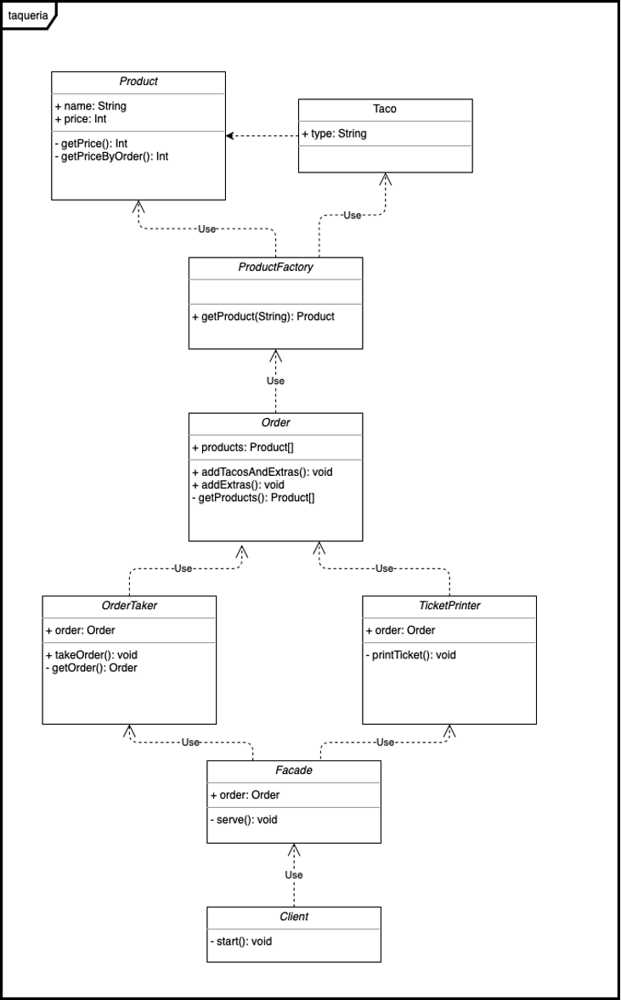
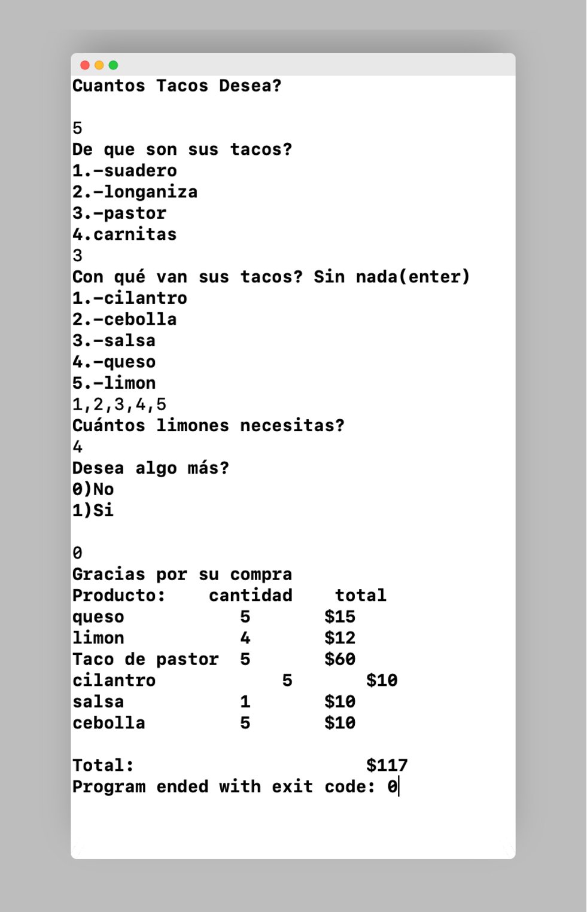

# Proyecto 3


## Planteamiento del Problema

En una taquería de la CDMX se desea saber los gastos aunados a diversos complementos que lleva cada taco como lo es el cilantro, los limones, la salsa, etc. Dicha taquería tiene una gama enorme de tacos de toda la República Mexicana que ofrece a sus comensales (clientes). 

Un cliente puede pedir un número N de tacos, sin embargo no todos los tacos llevan los mismos ingredientes, y tampoco es el mismo costo por cada ingrediente (ej. salsa, cilantro, chiles, limones, aguacate, etc, etc) Desarrollar el conjunto de clases, métodos, propiedades, extensiones y/o protocolos que resuelvan las siguientes preguntas. El cliente Pedro, comío 2 tacos de cecina, 1 taco de pastor, 1 taco de suadero, en todas las ordénes pidió solo cebolla y varios limones (6). 

¿Cuánto fue el costo total de la cuenta? ¿Cuánto se gasto en cebolla?, suponiendo que cada orden de cebolla costo 2 pesos, ¿cuánto se gasto en limones? tomando en cuenta que cada limón cuesta 3 pesos. 

Una pareja de recién casados piden una orden de 6 tacos de carnitas, 1 orden de salsa roja, 8 limones, cilantro y cebolla. 

Se deben contestar las mismas preguntas incluyendo ahora el cilantro y la salsa. En cada orden o comanda existen al menos entre 3 o 4 tipos de bebidas diferentes.

**Los costes de describen a continuación**

- 1 limón = 3 pesos 
- 1 orden de cebolla por taco = 2 pesos 
- 1 orden de cilantro por taco = 2 pesos 
- 1 orden de salsa = 10 pesos 
- 1 taco de carnitas = 15 pesos 
- 1 taco de suadero = 12 pesos 
- 1 taco de pastor = 12 pesos


### Resolución del problema

Para el desarrollo de los ejercicios se creó una “command line application” para tener acceso a la lectura de datos desde consola. Se modelaron las siguientes clases:

- **Clase Producto: **Contiene el nombre y su precio, para el modelado de algo más específico (como son los tacos), se modeló la clase Taco. Por otro lado, se implementó la clase ProductFactory, encargada de la creación de los productos de la taquería, tanto complementos como tacos. 
- **Clase Order: **Agrupa los productos que contieene un cliente compra, además contiene una lista d eproductos que se va modificanco cuando un cliente pide mas alimentos
- **Order Taker(Subsistema):**  mediante el cual se le pide y se registra la orden a un cliente, es un ciclo iterativo donde se le pregunta al cliente su orden hasta que ya no quiera añadir más tacos.
- **TicketPrinter(Subsistema):** Encargada de imprimir los costos y cantidades de los productos que un cliente pidió, extrayendo los objetos Producto de una Orden.
- **Clase Facade:** Para encapsular el funcionamiento de la taquería y la unión de los subsistemas OrderTacker y TicketPrinter. Así como la clase cliente, que es la que consume el servicio de la taqueria

### Diagrama UML

A continuación se presenta el diagrama UML modelado para este problema



### Código

#### Clase Producto

```swift
import Foundation

class Product {
  let name: String
  let price: Int
  init(name: String, price: Int){
    self.name = name
    self.price = price
  }
  func getPtriceByOrder(num:Int) -> Int{
    return self.price * num
  }
  func getPrice()->Int{
    return self.price
  }
}

```

#### Clase Taco

```swift
class Taco: Product{
  let type: String
  init(type: String, price:Int){
    self.type = type
    super.init(name: "Taco de \(type)", price:price)
  }
}
```


#### Clase ProductFactory

Clase en la que se implementa el patrón de diseño *Factory*, por medio de esta clase se pueden crear productos o tacos, sólo s ele necesita apsar el nombre del producto como parámetro

```swift
import Foundation

class ProductFactory{
  static func getProduct(type: String)-> Product{
    switch type{
      case "suadero":
          return Taco(type: "Suadero", price: 12)
      case "longaniza":
          return Taco(type: "longaniza", price: 10)
      case "pastor":
          return Taco(type: "pastor", price: 12)
      case "carnitas":
          return Taco(type: "carnitas", price: 20)
      case "cebolla":
          return Product(name: "cebolla", price: 3)
      case "limon":
          return Product(name: "limon", price: 2)
      case "cilantro":
          return Product(name: "cilantro", price: 2)
      case "salsa":
          return Product(name: "salsa", price: 10)
      case "queso":
          return Product(name: "queso", price: 3)
      default:
          return Product(name: "invalid", price: 0)
    }
  }
}
```

#### Clase Order

Esta clase es la encargada de agrupar los productos del cliente, tiene métodos de crear y agregar productos a la orden. Ya sean tacos y extras, tacossolos o solo extras.

```swift
import Foundation

class Order{
  var products: [Product]
  init(){
    self.products = []
  }
  func addTacosAndExtras(number: Int, type:String, extras:[String]){
    let tacos = 1...number
    for _ in tacos{
      self.products.append(ProductFactory.getProduct(type:type))
      for extra in extras{
        if extra != "salsa" && extra != "limon"{
          self.products.append(ProductFactory.getProduct(type:extra))
        }
      }
    }
  }
  func addExtras(number:Int, type:String){
    let count = 1...number
    for _ in count{
      self.products.append(ProductFactory.getProduct(type:type))
    }
  }
  func getProducts() -> [Product]{
    self.products
  }
}
```

#### Clase Order Taker

Esta clase simula es un subsistema que toma las órdenes de los clientes, es la encargada de crear y llenar la orden de un cliente

```swift
class OrderTaker{
  var order: Order
  init(){
    order = Order()
  }
  func takeOrder(){
    let tacosTypes: [Int:String] = [1: "suadero", 2: "longaniza", 3: "pastor", 4: "carnitas"]
    let tacosComplements: I[Int:String] = [1: "cilantro", 2: "cebolla", 3: "salsa", 4: "queso", 5:"limon"]
    var isDone: Bool = false
    repeat{
      var tacosNumber = 0
      print("Cuantos Tacos desea?")
      tacosNumber = Int(readLine() ?? "0")!
      if tacosNumner != 0{
        print("De que son sus Tacos?\n1.-Suadero\n2.-Longaniza\n3.-Pastor\nCarnitas")
        let tacoType = Int(readLine() ?? "1")!
        print("Con que van sus tacos? Sin nada(enter)\n1.-Cilantro\n2.-Cebolla\n3.- Salsa\n4.-Queso\n5.-Limon")
        if let extrasInput = readLine(){
          let extras = extrasInput.lowercased().split(separator: ",").map({tacosComplements[Intr($0)!]!})
          self.order.addTacosAndExtras(number: tacosNumber, type:TacosTypes[tacoType]!, extras: extras)
          if extras.contains["salsa"]{
            self.order.addExtras(number:1, type: "salsa")
          }
          if extras.contains["limon"]{
            print("Cuantos Limones necesitas?")
            let lemonsNumber = Int(readLine() ?? "1")!
            self.order.addExtras(number: lemonsNumber, type: "limon")
          }
        }else{
          self-order.addTacosAndExtras(number:tacosNumber, type: tacosTypes[tacoType]!, extras[])
        }
      }
      print("Desea algo mas?")
      isDone = Bool(readlLine() ?? "true")!
    }while(isDone)
  }
  func getOtder() -> Order{
    self.order
  }
}
```

#### Clase TickerPrinter

Clase que simula la impresión deTickers. Imprime las cantidades de productos, así como los totales del pedido y sus costos

```swift
class TikcetPrinter{
  static func printTicket(order: Order){
    let allProducts = order.getProducts().reduce(into: [String: (number; Int, total: int)]()){ result, product in
      if let acc = result[product.name]{
        result[product.name] = (acc.number + 1, acc.total + product.getPrice())
      }else{
        result[product.name] = (number: 1, total:product.getPrice())
      }
    }
    print("Gracias por su compra")
    print("Producto: \t Cantidad\t Total")
    var total = 0
    for(ket, value) in allProducts{
      total += value.total
      if key < 14{
        print("\(key)\t\t\t(value.number)\t\t$(value.total)")
      }else{
        print("\(key) \(value.number)\t\t$\(value.total)")
      }
  	}
    print("\nTotal: \t\t\t\t\t\t\t\t\t$\(total)")
  }
   
}
```

#### Clase Facade

Encargada de agrupar dos subsistemas y llevar a cabo la ejecución de las responsabilidades que el cliente desea consumir. Es decir, tomar sus órdenes y darle el total de su compra y productos. Implementación del patrón de diseño Facade.

```swift
class Facade{
  static func serve(){
    let orderT = OrderTaker()
    orderT = OrderTaker()
    let order = OrderT.getOrder()
    TicketPrinter.printTicket(order: order)
  }
}
```

#### Clase Cliente

```swift
class Client{
  static func start(){
    Facade.serve
  }
}
Client.start()
```


### Capturas de Pantalla




## Conclusiones

Para este proyecto ya tenía mayor dominio y facilidad en el lenguaje de programación Swift, por lo que fue mas sencillo realizar estos 5 programas, sólo tuve algunos tropiezos con mi lógica propia

[Repositorio de Github](https://github.com/galigaribaldi/Codigos_swift/tree/master/Computo_Movil)

